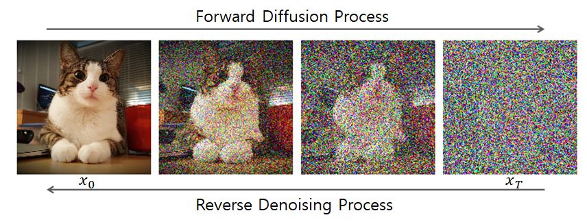

# DDSC: Masked Discrete Diffusion for Gene Expression 

## Motivation
Gene expression count vectors are challenging for machine learning models.
- They have a very distribution with many zeros
- Long tailed with few very large values
- "Noisy" and highly variable across different samples

  
Visualized is a histogram of count magnitudes from 1M sampled cells. 

  

Here is an example of the first 30 rank values of a cell sequence: [0.,  0.,  0.,  0.,  0.,  0.,  0.,  0.,  0.,  0.,  0., 37.,  0.,
         0.,  0.,  0.,  0.,  0.,  0., 37.,  0.,  0.,  0., 45.,  0.,  0.,  0.,
         0.,  0.]. As we can see, the data is highly non-uniform with few large values.

### Working in discrete space vs continuous space 
For the reason above, raw counts can be a problematic input space to train on. 
- Under a L2 loss, the model **dominated by the large counts** and lead to many errors of small counts.
- Natural to instead normalize and consider gene expression count *ranks*.
  - Ranks are discrete by definition (vs floating point numbers)
 
With this we frame the problem as **sequence to sequence** modelling problem. Moreover, we use a **generative modelling** framework to generate masked count rank values. 

This fits well with a masked language discrete diffusion model, which we train on the Tahoe 100M dataset. 

### Current methods

  

- mosaicFM uses a encoder only model with transformer; predict continuous values
- scDiffusion uses diffustion in latent space (typical gaussian diffusion)
- scRDiT uses DDPM with transformer backbone

To the best of our knowledge, the discrete diffusion for the gene expression count domain is **largely unexplored**.

### Method 
We train a conditional diffusion model on the gene expression count rank sequences. Specifically, we condition on the gene IDs. We follow the MosiacFM work and consider sequences of length 1024. 
We train using a DiT backbone. 

Currently, we have train for 70k batches or approximately 4.5 million cells. 
With limited training we get around 0.6 NLL

  

### Handling "ordinal" values under categorical loss
One major fundamental limitation of modeling gene count vectors as a sequence of tokens is that **tokens are not inherently ordinal**. 
This can lead to bad inference if the model has no bias towards "closer" tokens i.e ranks of similar value. 

We recognize however that the actual gene count data can be quite noisy and variable; thus we think it **makes sense for models to output distributions** rather a "dirac delta" guess of one floating point number.

To reconcile these issues, we use a mixed loss: both the cross entropy or log loss $p(x_t^i | \cdot)$ to encourage the model to predict the 'correct" rank and also a **mean-matching loss to tie the distribution's mean to match the "correct" value**, 
$$||\sum p(x_t^j)x_t^j - x_t^i||$$. 
In total we have *log_loss + mean_matching_loss*

### Inpainting Generation
We can do flexible controllable generation with our discrete diffusion model and toggle the level and location of masking. 

For example here is generation from a highly corrupted gene count vector. 

  

and here is generation for a minimally corrupted gene count vector.

  

### Preliminary experiments
Inpainting generation seems to show some promise in recovering missing/removed count tokens, even with high (80%) degradation and removal of counts.

  

### Code acknowledgements
This repo builds on the MosaicFM repo (specifically using their dataloaders). It adapts MDLM code from https://github.com/kuleshov-group/mdlm/.

                                                              |

